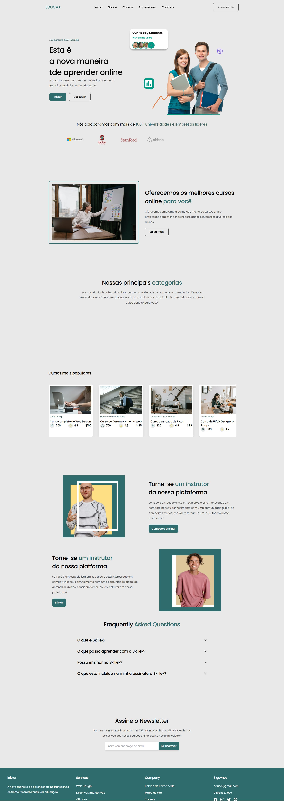
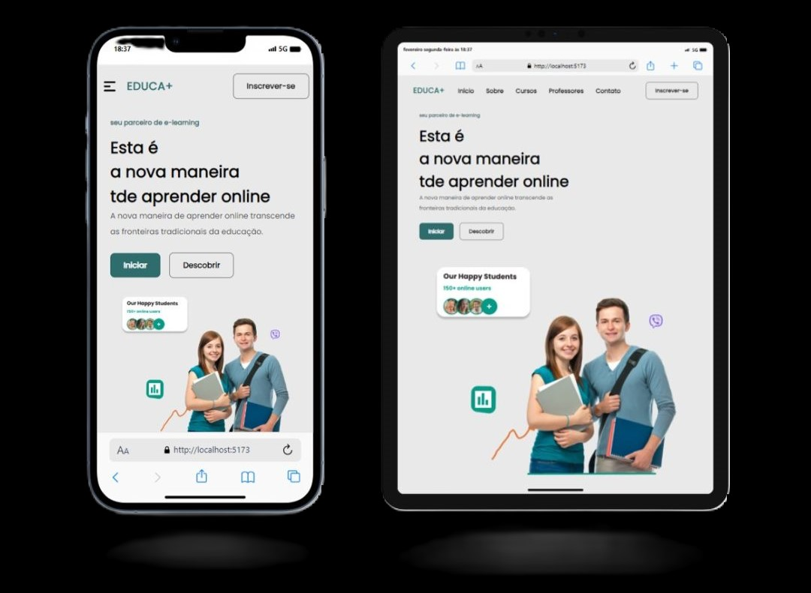

<a href="https://danielportela.netlify.app/">Site educacional</a> com React

&nbsp;
&nbsp;
&nbsp;

<a href="https://danielportela.netlify.app/">O EDUCA+</a> é um projeto dedicado à transformação da educação online, oferecendo uma plataforma abrangente para aprendizado e ensino. A missão é proporcionar uma experiência educacional de alta qualidade, transcendendo as fronteiras tradicionais da aprendizagem.

<a href="https://danielportela.netlify.app/"><strong>Demonstração ao vivo</strong></a>

Funcionalidades principais:

- Início: Página inicial intuitiva e informativa.

- Sobre: Seção para conhecer mais sobre o EDUCA+ e sua missão.

- Cursos: Exploração dos cursos oferecidos, categorizados por interesse.

- Professores: Informações sobre os instrutores e especialistas.

- Contato: Canal de comunicação para dúvidas e feedback.

- Inscrever-se: Facilidade para novos alunos se registrarem.  

Tecnologias utilizadas:

O EDUCA+ é desenvolvido utilizando tecnologias modernas para garantir uma experiência de usuário fluida e eficaz. Algumas das tecnologias principais incluem:

- React: Uma biblioteca JavaScript para construção de interfaces de usuário.

- HTML5/CSS3: Fundamentais para estruturação e estilo do site.

- JavaScript: Para funcionalidades dinâmicas e interativas.

- Node.js: Utilizado no backend para operações de servidor.  

Confira todos os códigos <a href="https://danielportela.netlify.app/">aqui</a>  

<b>Autor</b>

Este projeto foi desenvolvido por <a href="https://github.com/daniel-portela/">Daniel Portela</a>

<b>Licença</b>

Este projeto está sob [LICENSE](LICENSE), o que significa que você não tem permissão para usar, modificar e distribuir o código conforme desejar, desde que mantenha o aviso de direitos autorais e a licença. Contudo, se você encontrar bugs, tiver sugestões de melhorias ou quiser contribuir de alguma forma, ficarei feliz em receber seu feedback.

<b>Contato:</b>

Se você tiver alguma dúvida, sugestão ou interesse em colaborar, não hesite em nos contatar.

Email: danielportela.ti@gmail.com

 
 

